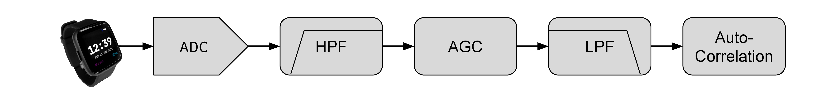

# Rust Rate-Based Session Types

This repository contains a prototype implementation of rate-based session types as a Rust crate. It is split into two parts: the Rust standard library based crate implementation in `rust_pst` and a version specialized to FreeRTOS on the STM32F407 in `STM32_FreeRTOS`.

# Headline Example: Heart Rate

The main example in this artifact is a heart rate sensor (PhotoPlethysmoGram, or PPG) and corresponding signal processing derived from the [WaspOS implementation](https://github.com/wasp-os/wasp-os/blob/master/wasp/ppg.py) used in [InfiniTime](https://github.com/InfiniTimeOrg/InfiniTime/blob/develop/src/components/heartrate/Ppg.cpp) for the PineTime smartwatch.

This is implemented as both an example in the included `rust_pst` crate and as the main application run in the FreeRTOS version. The FreeRTOS version reads data from a hardware sensor, does the signal processing inside the microcontroller, and renders the results on an attached display. Once programmed into the STM32, it is fully standalone and requires only a power supply. The `rust_pst` crate example uses prerecorded sample data from `ppg24.txt`.

Each of these signal processing blocks corresponds to a periodic task defined in [ppg_tasks.rs](./STM32_FreeRTOS/src/ppg_tasks.rs) and [examples/ppg.rs](./rust_pst/examples/ppg.rs).

A full video of the system in operation is in [assets/ppg_h264.mp4](./assets/ppg_h264.mp4). Note: the display flickering is a camera artifact and is not visible in operation.

# `rust_pst` Crate Implementation

- `session.rs`: session type traits and compatibility checking
- `pkt.rs`: allocation free synchronous transmutable channel 
- `chan.rs`: operations on channels and tasks
- `nat.rs`: type level natural numbers (standard)
- `macros.rs`: declarative macros to generate type annotations
- `ppg.rs`: signal processing algorithms

# Crate Examples

The following examples are provided as part of the `rust_pst` crate:

- Rate Mismatch (`mismatch.rs`): A rate mismatch that (correctly) fails to compile
- PineTime Heart Rate (`ppg.rs`): An implementation of the heart rate sensor using prerecorded data
- Second Order IIR Filter (`iir.rs`): An DSP filter parameterized over the ratio of rate transformation -- showcases how Rust generics and type inference can be integrated with our crate
- Signal Processing Blocks (`simple.rs`, `rate12.rs`, and `building-blocks.rs`): A variety of small processes utilizing Rust generics.

Additionally, types for the following systems are provided:

- Smartwatch Rate Transformation (`ppg-rt.rs`): Alternate pipeline for heart rate sensor that assumes a rate transformation.
- Gravity (`gravi.rs`): A model of the Android gravitation software sensor
- Orientation(`orientation.rs`): A model of Android sensor fusion for orientation determination
- Wake Word (`wake-word.rs`): A model of wake word detection, based on the TinyML example (https://create.arduino.cc/projecthub/3a1a/tinyml-wake-word-detection-98aaa8)
